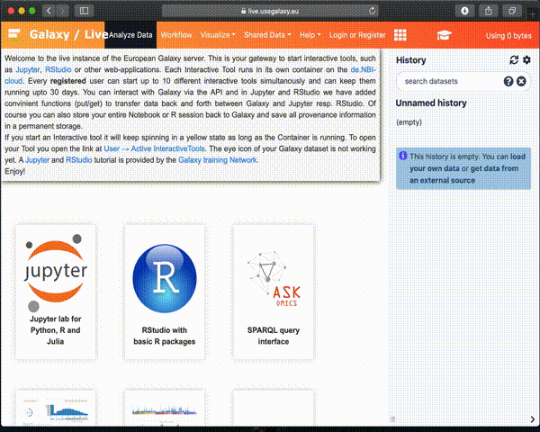

# pyiron galaxy example

Demonstrate how to run [pyiron](https://pyiron.org) on [live.usegalaxy.eu](https://live.usegalaxy.eu). The galaxy tool definitions are available on: 

* [Dockerimage](https://github.com/bgruening/docker-jupyter-notebook/blob/pyiron/Dockerfile) for the interactive Jupyter lab session.
* [interactive Tool definition](https://github.com/usegalaxy-eu/galaxy/blob/release_20.05_europe/tools/interactive/interactivetool_pyiron.xml)
* Lammps job execution [Tool definition](https://github.com/usegalaxy-eu/temporary-tools/blob/master/pyiron/pyiron.xml)
